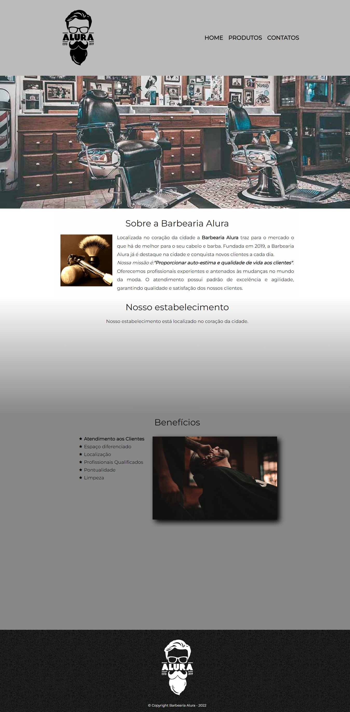

<h1 align="center">Barbearia Alura</h1>

<h3 align="center">A Barbearia Alura foi desenvolvida durante quatro cursos de HTML5 e CSS3 da Alura.</h3>

 

  

## Tópicos

- [Imagem do projeto](#imagem)
- [Descrição do projeto](#desc)
- [Tecnologias utilizadas](#tech)
- [Acesso ao projeto](#acesso)
- [Status do projeto](#status)
- [Licença](#license)

 

<h2 id="imagem">🎞️ Imagem do projeto</h2>

    

 

<h2 id="desc">📚 Descrição do projeto</h2>

    A Barbearia Alura é um site que mostra os serviços oferecidos pelos barbeiros da barbearia, mostra também a localização do lugar onde é realizado os trabalhos dos barbeiros, mostra os benefícios do local e possui uma página de formulário para melhor comunicação com os clientes, essa página de formulário possui também uma tabela com os dias e horários de funcionamento do estabelecimento.

 

<h2 id="tech">🛠️Tecnologias utilizadas</h2>

* HTML e CSS
* Git e Github

 

<h2 id="acesso">⚓ Acesso ao projeto</h2>

Acesse o projeto clicando [aqui](https://fel1324.github.io/Barbearia-Alura/)

 

<h2 id="status">🖼️ Status do projeto</h2>

<h4 style="text-transform: uppercase; color: #0F0">✔️ Projeto finalizado</h4>

 

<h2 id="license">✏️ Licença</h2>

Esse projeto está sob a licença MIT.
